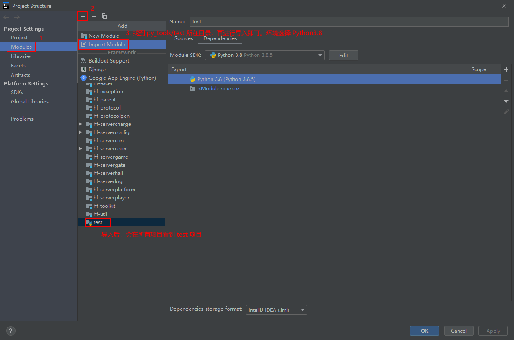

## Python 环境安装

1. Python安装包所在路径：`\\10.198.141.130\sgp_dev\服务器用常用软件\\python-3.8.5.exe`

2. 傻瓜式安装。

3. 安装后检查环境变量是否配置好，若无，则手动配置一下

   

4. IDEA 集成 Python 环境

   

5. IDEA 导入项目

   


## Test 脚本

### 脚本介绍


1. `api.ini`  脚本配置文件。具体配置查看文件注释。

2. `players.ini`  玩家账号信息。不需手动输入！

   ```ini
   # 本地环境
   [Local]
   10373 = {"isUsed": 0, "account": "tr10205", "password": "12345678", "channel": "test2", "playerId": 10373}
   # 测试环境
   [test]
   # 正式测试服1环境
   [formal_test_1]
   #  正式测试服2环境
   [formal_test_2]
   ```

3. `api_test.py`  接口测试脚本，结果返回为 json 对象。调用 `task.add_command("protocalName", [param1, param2, ...])`

   - **protocalName**：接口协议名称。如：ReqGiveMeItems  ReqFunctionStatus  ReqRefreshConfigTable

   - **param**：接口所需参数。无需参数保留 "**[]**" 即可。

     传参规则如下

     - **byte、shot、int、long、float、double** 类型：直接输入数字即可。eg: [1, 1.5, 999999999]
     - **String** 类型："字符串"。eg：["字符穿"]
     - **Map<String, Integer>** 类型：通过 **"{}"** 花括号包裹。eg：[{"1001": 10000000000]
     - **[] 数组类型**：通过 **"[]"** 包裹。eg：[[1,2,3]]

     eg：

     ```python
     if __name__ == '__main__':
         task = Task()
     
         # 刷新配置表  0: 服务器类型 1: 所有服务器; 3: hall; 4: game; 5: player; 6: platform    True: 测试服重新下载
         # task.add_command("ReqRefreshConfigTable", [1, False])
         # task.add_command("ReqRefreshConfigTable", [1, True])
     
         # 获取功能状态  funcId
         # task.add_command("ReqFunctionStatus", [500500])
         
         # 客户端请求某个商店的具体内容  funcId
         # task.add_command("ReqShopGoods", [180800])
     
         # 请求给我发放一些道具: 指定道具map  key  指定玩家id
         # task.send_msg_and_receive("ReqGiveMeItems", [{"1107": 1000}, helper.KEY, 10358])
     
         task.start()
     ```

     

4. `force_api_test.py`  压测脚本。


### 脚本运行

1. 方式1：命令运行。切换到脚本所在目录，打开cmd窗口，输入命令。eg：`python api_test.py`

   

2. 方式2：idea配置好环境跟导入项目后，**IDEA 打开脚本文件，通过 main 方法执行脚本**。

   